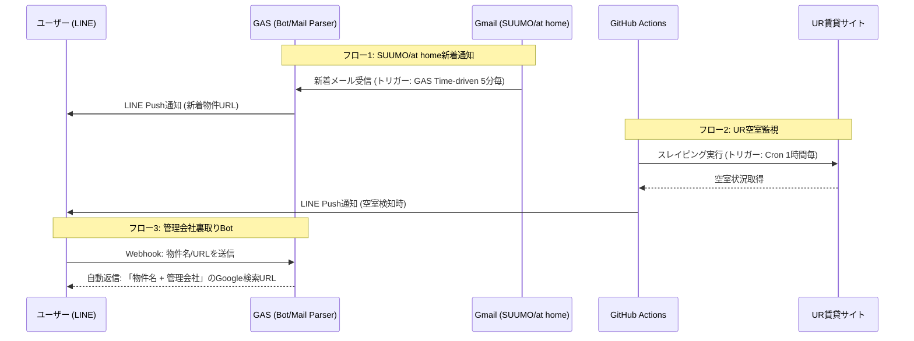

# 物件探し自動化システム (Real Estate Search Automation)

「SUUMO/at homeの広域相場把握」「UR賃貸の空室監視」「LINE Botによる裏取り・管理会社特定」の3つのフローを、完全無料（サーバーレス）で自動化・効率化するシステムです。

## 1. 必要なもの（Prerequisites）

### アカウント関連（すべて無料枠）
* **Google アカウント**: Gmail受信、Google Apps Script (GAS) 実行用
* **GitHub アカウント**: コードのバージョン管理、GitHub Actions (定期実行) 用
* **LINE アカウント / LINE Developers**: LINE Messaging API (BotおよびPush通知) 用

### ローカル開発環境
* **Node.js / npm**: `clasp` (GAS CLI) およびGASのTypeScriptコンパイル用
* **Git**: バージョン管理
* **エディタ**: VS Code (推奨)
* **Python 3.x**: (ローカルでUR監視スクリプトをテストする場合)

---

## 2. システム設計書 (Architecture)

本システムは大きく分けて3つのサブシステムから構成されます。

### 2.1. 構成図 (Mermaid)



### 2.2. 各コンポーネントの責務
1. **GAS (gas/ ディレクトリ)**
   * **メール解析 (Time-driven)**: 未読の物件新着メールを解析し、LINEへPush通知後に既読化。
   * **Webhook受信 (doPost)**: LINE Botからのメッセージを受け取り、管理会社検索用のURLを組み立ててReply。
2. **Python スクリプト (python_scraper/ ディレクトリ)**
   * **UR空室監視**: UR賃貸の特定の検索URLへリクエストを送り、HTML差分から空室の有無を判定。
3. **GitHub Actions (.github/workflows/)**
   * **定期実行 (Cron)**: Pythonスクリプトを定期的に実行（例：毎日数回）。シークレット環境変数からLINE APIキーを読み込み。

---

## 3. フォルダ構成

プロジェクトルート直下で、GASとPython（GitHub Actions用）を統合管理します。

```text
.
├── .github/
│   └── workflows/
│       └── ur_monitor.yml       # GitHub Actionsの定期実行定義
├── gas/                         # GAS管理ディレクトリ (clasp)
│   ├── .clasp.json              # claspプロジェクト設定 (Git管理外推奨、またはテンプレ化)
│   ├── appsscript.json          # GASマニフェスト (タイムゾーン等の設定)
│   ├── package.json             # TypeScript/clasp等の依存関係
│   ├── tsconfig.json            # TypeScript設定
│   └── src/                     # GASソースコード
│       ├── main.ts              # エントリポイント (doPost等)
│       ├── emailParser.ts       # Gmail検索・解析ロジック
│       └── lineBot.ts           # LINE API通信ロジック
├── python_scraper/              # UR賃貸監視用スクリプト
│   ├── requirements.txt         # pipパッケージ (requests, beautifulsoup4等)
│   └── ur_check.py              # スクレイピング＆LINE通知メインロジック
├── .gitignore                   # 機密ファイル(.clasp.json等)を除外
└── README.md                    # 本ドキュメント
```

---

## 4. 環境構築手順 (Environment Setup)

### 4.1. リポジトリの初期化
```bash
git init
mkdir -p .github/workflows gas/src python_scraper
```

### 4.2. GAS (clasp) のセットアップ
```bash
cd gas
npm init -y
npm install -D @google/clasp typescript @types/google-apps-script

# Googleアカウント認証
npx clasp login

# GASプロジェクトの新規作成 (スタンドアロン)
npx clasp create --type standalone --title "EstateAutoBot"
```
※ コマンド実行後、生成される `.clasp.json` はプロジェクトIDが含まれるため、セキュリティポリシーに応じて `.gitignore` に追加してください。

### 4.3. Python環境のセットアップ (任意・ローカルテスト用)
```bash
cd ../python_scraper
python -m venv venv
source venv/bin/activate  # Windows: venv\Scripts\activate
pip install requests beautifulsoup4
pip freeze > requirements.txt
```

---

## 5. 設定手順 (Configuration Steps)

### 5.1. LINE Developers の設定
1. [LINE Developers](https://developers.line.biz/) にログイン。
2. 「プロバイダー」を作成し、「Messaging API」チャネルを作成。
3. **チャネルアクセストークン（長期）** を発行し、メモする。
4. ※ Webhook URLは、後述のGASデプロイ後に設定します。

### 5.2. GAS のデプロイとプロパティ設定
1. `gas/src` 配下にロジックを実装し、ローカルからプッシュします。
   ```bash
   cd gas
   npx clasp push
   ```
2. ブラウザでGASエディタを開きます（`npx clasp open`）。
3. **スクリプトプロパティの設定**:
   * プロジェクトの設定（歯車マーク） > スクリプトプロパティ
   * `LINE_ACCESS_TOKEN` = 取得したチャネルアクセストークンを追加。
4. **ウェブアプリとしてデプロイ**:
   * 「デプロイ」>「新しいデプロイ」> 種類の選択「ウェブアプリ」
   * アクセスできるユーザー: 「全員」
   * 発行された **ウェブアプリのURL** をコピー。
5. **LINE Webhook設定**:
   * LINE Developersに戻り、Webhook URLにコピーしたURLを貼り付けて「検証」をパスさせる。「Webhookの利用」をオン。
6. **定期トリガーの設定 (メール監視用)**:
   * GASエディタの「トリガー（時計マーク）」から、新着メール確認用の関数（例: `checkNewHouseEmails`）を「時間主導型」「分ベースのタイマー」「5分おき」等で設定。

### 5.3. GitHub Actions の設定 (UR監視)
1. 本リポジトリをGitHubにPushします。
2. GitHubリポジトリの **Settings > Secrets and variables > Actions** に移動。
3. **New repository secret** を作成:
   * Name: `LINE_ACCESS_TOKEN`
   * Secret: LINEのチャネルアクセストークン
4. `.github/workflows/ur_monitor.yml` が main ブランチにPushされると、定義されたCronスケジュールに従って自動監視が開始されます。

---
**Note:** 本システムのスクレイピング機能は各サイトの利用規約（特に頻度・負荷）に十分配慮してスケジュール（Cron）を設定してください。