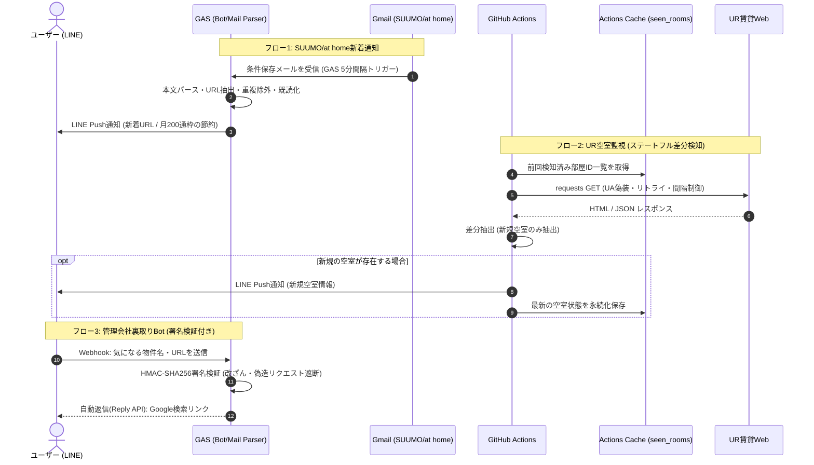

# 物件探し自動化システム (Real Estate Search Automation)

「SUUMO/at homeの広域相場把握」「UR賃貸の空室監視」「LINE Botによる裏取り・管理会社特定」の3つのフローを、完全無料（サーバーレス）かつ安全に自動化・効率化するシステムです。

---

## 1. 必要なもの（Prerequisites）

### アカウント・サービス（すべて無料枠）
* **Google アカウント**: Gmail受信、Google Apps Script (GAS) 実行用
  * ※ clasp利用のため、あらかじめ「[Google Apps Script ユーザー設定](https://script.google.com/home/usersettings)」で **Google Apps Script API を「オン」** に設定してください。
* **GitHub アカウント**: コードのバージョン管理、GitHub Actions (UR定期監視) 用
* **LINE Developers アカウント**: LINE Messaging API (通知・Bot) 用
  * LINE Official Account の無料枠: **月200通までPush送信無料**（※Webhookに対するReply返信は無制限無料）。

### ローカル開発環境
* **OS**: macOS / Linux / Windows (WSL2推奨)
* **Node.js**: v18.x 以上 / npm
* **Python**: 3.10 以上 (UR監視スクリプトのローカル検証用)
* **Git**: バージョン管理
* **VS Code** (推奨エディタ)

---

## 2. システム設計 (Architecture)

### 2.1. 構成図 (Sequence Diagram)



### 2.2. 各コンポーネントの責務と仕様
| コンポーネント | ディレクトリ | 実行基盤 | トリガー | 主なセキュリティ・リスク対策 |
| :--- | :--- | :--- | :--- | :--- |
| **新着メールパーサー** | `gas/src/emailParser.ts` | GAS | 時間主導型 (5分毎) | ・Gmail検索クエリ最適化<br>・同一物件の二重送信防止（PropertiesService利用） |
| **裏取り返信Bot** | `gas/src/main.ts` | GAS (Web App) | LINE Webhook (`doPost`) | ・**X-Line-SignatureのHMAC-SHA256検証**<br>・無料のReply API限定利用（Push枠消費ゼロ）<br>・入力テキストのサニタイズ |
| **UR空室チェッカー** | `python_scraper/` | GitHub Actions | Cron 定期実行 | ・**Actions Cacheによる状態管理（空室差分のみ通知）**<br>・User-Agent付与および過剰アクセス防止（ジッター追加）<br>・データセンターIPブロック時のフォールバック |

---

## 3. セキュリティ・リスク管理方針 (Security & Risk Management)

本システムは外部公開エンドポイント（GAS）および外部サイトへのクローリング（GitHub Actions）を含むため、以下の安全設計を前提とします。

1. **Webhookエンドポイントの保護 (なりすまし防止)**
   * GAS Web Appは「全員（Anyone）」に公開する必要がありますが、`X-Line-Signature` リクエストヘッダーを `LINE_CHANNEL_SECRET` を鍵としてHMAC-SHA256で検証し、LINEサーバー以外からのリクエストを直ちに401/403で遮断します。
2. **LINE Push通信枠の枯渇防止 (サーキットブレーカー)**
   * LINEのPush通知は月200通の上限があります。万一の無限ループや誤検知による通知バーストを防ぐため、GAS側の `PropertiesService` を用いて日次送信数カウンターを実装し、1日の送信上限（例: 1日10件）に達した場合は通知を自己抑制します。
3. **ステートレスなGitHub Actionsにおける空室二重通知の防止**
   * GitHub Actionsの仮想環境は実行ごとに初期化されます。前回の空室状態を `actions/cache` またはコミット管理で保持しない場合、空室がある間じゅう毎時Push通知が送信されて無料枠を即座に使い果たします。必ずキャッシュファイル（`seen_rooms.json`）を復元・比較・更新するアーキテクチャを採用します。
4. **URサイトへのアクセス負荷軽減とIP遮断対策**
   * GitHub ActionsのIPレンジ（Azure）からのアクセスはボット判定を受けやすいため、一般的なブラウザのUser-Agentを設定し、リトライ時はExponential Backoffを行います。また、アクセス頻度は最短でも1時間間隔とします。
5. **認証情報・シークレットのGit流出防止**
   * リポジトリにはアクセストークン、チャネルシークレット、ユーザーID、およびclaspのセッションファイル（`.clasprc.json`）を一切コミットしません。

---

## 4. ディレクトリ構成

```text
my-estate-bot/
├── .github/
│   └── workflows/
│       └── ur_monitor.yml       # GitHub Actions (Cache対応・定期実行)
├── gas/                         # Google Apps Script 開発環境
│   ├── .clasp.json              # clasp設定ファイル (Git管理対象外)
│   ├── .claspignore             # GASアップロード除外設定
│   ├── appsscript.json          # GASマニフェスト (タイムゾーン設定)
│   ├── package.json             # TypeScript / clasp / 暗号化モジュール型定義
│   ├── tsconfig.json            # TypeScript設定 (rootDir整合)
│   └── src/
│       ├── main.ts              # Webhook (doPost) / 署名検証エントリポイント
│       ├── emailParser.ts       # Gmail検索・重複除外・新着判定
│       └── lineClient.ts        # LINE Messaging API ラッパー (Reply / Push)
├── python_scraper/              # UR賃貸スクレイピング環境
│   ├── requirements.txt         # 依存ライブラリ (requests, beautifulsoup4)
│   ├── ur_check.py              # 差分比較・スクレイピング・通知ロジック
│   └── data/                    # 状態永続化用ディレクトリ (Cache対象)
│       └── .gitkeep
├── .gitignore                   # 機密情報・ビルド成果物除外
└── README.md                    # 本ドキュメント
```

---

## 5. 環境構築手順 (Setup Guide)

### 5.1. プロジェクトディレクトリの作成とGit初期化

端末（ターミナル）を開き、プロジェクト用ディレクトリを作成してGit初期化を行います。

```bash
# 1. プロジェクトディレクトリ作成と移動
mkdir my-estate-bot
cd my-estate-bot

# 2. Gitリポジトリ初期化
git init

# 3. 必要なディレクトリ構成を一括作成
mkdir -p .github/workflows gas/src python_scraper/data
touch python_scraper/data/.gitkeep
```

### 5.2. `.gitignore` の作成

認証情報や仮想環境がGitに混入しないよう、プロジェクトルートに `.gitignore` を配置します。

```bash
cat << 'EOF' > .gitignore
# OS / Editor
.DS_Store
Thumbs.db
.vscode/
.idea/

# Node.js / clasp
node_modules/
npm-debug.log
.clasp.json
.clasprc.json

# Python
__pycache__/
*.py[cod]
venv/
.env

# Cache / Local State Data
python_scraper/data/seen_rooms.json

# Build Artifacts
dist/
EOF
```

### 5.3. GAS (TypeScript / clasp) のセットアップ

```bash
cd gas

# 1. パッケージ定義の初期化
npm init -y

# 2. 必要な開発ツールのインストール
npm install -D @google/clasp typescript @types/google-apps-script

# 3. tsconfig.json の作成
cat << 'EOF' > tsconfig.json
{
  "compilerOptions": {
    "target": "ES2020",
    "module": "None",
    "lib": ["ES2020"],
    "strict": true,
    "noImplicitAny": true,
    "types": ["google-apps-script"]
  },
  "include": ["src/**/*"]
}
EOF

# 4. .claspignore の作成
cat << 'EOF' > .claspignore
**/*
!src/appsscript.json
!src/**/*.ts
!src/**/*.js
EOF

# 5. Googleアカウントへログイン (ブラウザで承認)
npx clasp login

# 6. 新規GASプロジェクトの作成 (rootDir を ./src に明示)
npx clasp create --type standalone --title "EstateAutoBot" --rootDir ./src
```

※ `clasp create` 完了後、`gas/.clasp.json` 内の `"rootDir"` が `"./src"` に指定されていることを確認してください。

### 5.4. Python スクレイピング環境のセットアップ

```bash
cd ../python_scraper

# 仮想環境作成と有効化
python -m venv venv
source venv/bin/activate  # Windows (PowerShell): .\venv\Scripts\Activate.ps1

# 依存パッケージのインストール
pip install requests beautifulsoup4
pip freeze > requirements.txt

# ルートディレクトリへ戻る
cd ..
```

---

## 6. 設定・デプロイ手順 (Configuration & Deployment)

### 6.1. LINE Developers の設定
1. [LINE Developers コンソール](https://developers.line.biz/) にログイン。
2. 新規プロバイダーを作成し、「**Messaging API**」チャネルを作成。
3. **キー情報の取得と保存**:
   * **チャネルアクセストークン（長期）**: 「Messaging API設定」タブより発行。
   * **チャネルシークレット (Channel Secret)**: 「チャネル基本設定」タブより取得（※署名検証に使用）。
   * **あなたのユーザーID**: 「チャネル基本設定」タブ最下部にある `U` から始まる文字列を取得。
4. **機能設定**:
   * 「応答設定」で「応答メッセージ」をオフ、「Webhook」をオンに設定。

### 6.2. Gmail フィルタの設定 (重要)
SUUMOやat homeの条件保存メールをGASが確実に捕捉できるよう、Gmail側で自動仕分けを設定します。
1. Gmailの検索バーに `from:(suumo.jp OR athome.co.jp)` を入力。
2. 検索オプション「フィルタを作成」をクリック。
3. 以下の処理を設定:
   * **「ラベルを付ける」**: `物件通知`（新規作成）
   * **「受信トレイをスキップ」**: 推奨（通知の重複確認用）

### 6.3. GAS のデプロイと環境変数設定
1. `gas/src/` 配下にソースコードを配置。
2. GASへソースコードを同期:
   ```bash
   cd gas
   npx clasp push
   ```
3. ブラウザでエディタを開く:
   ```bash
   npx clasp open
   ```
4. **スクリプトプロパティの登録**:
   * プロジェクトの設定（歯車アイコン） >「スクリプト プロパティ」に以下を登録:
     * `LINE_ACCESS_TOKEN`: チャネルアクセストークン
     * `LINE_CHANNEL_SECRET`: チャネルシークレット（署名検証用）
     * `LINE_USER_ID`: あなたのLINEユーザーID
     * `GMAIL_SEARCH_QUERY`: `label:物件通知 is:unread`
5. **Webアプリとしてのデプロイ**:
   * 「デプロイ」>「新しいデプロイ」をクリック。
   * 種類:「ウェブアプリ」を選択。
   * 次のユーザーとして実行:「自分」
   * アクセスできるユーザー:「全員 (Anyone)」
   * 発行された **ウェブアプリのURL** をコピー。
6. **LINE Webhook URL の登録**:
   * LINE Developers の「Webhook URL」にコピーしたURLを登録し、「検証」を実行（※署名検証ロジックが正常なら200 OKが返ります）。
7. **時間主導型トリガーの設定**:
   * 左メニュー「トリガー」から `checkNewHouseEmails` を「時間主導型」「分ベースのタイマー」「5分おき」で登録。

### 6.4. GitHub Actions の設定 (UR定期監視・State Cache)
1. ローカルの変更をプライベートリポジトリへプッシュ:
   ```bash
   git add .
   git commit -m "feat: setup project structure with security standards"
   git branch -M main
   git remote add origin <YOUR_GITHUB_REPO_URL>
   git push -u origin main
   ```
2. リポジトリの **Settings > Secrets and variables > Actions** に以下を登録:
   * `LINE_ACCESS_TOKEN`: LINEチャネルアクセストークン
   * `LINE_USER_ID`: あなたのLINEユーザーID
3. **ワークフロー定義 (`.github/workflows/ur_monitor.yml`)**:
   * `actions/cache` を使用し、`python_scraper/data/seen_rooms.json` を復元・保存するステップを必ず含めてください。これにより前回の空室状態との「差分」のみを通知し、無駄なPush送信を完全に防止します。
   * Cron定義はUTC基準（JST - 9時間）で指定します（例: JST 9:00〜21:00の間、2時間おきに実行）。

---

## 7. トラブルシューティング & 運用確認

| 現象 | 主な原因 | 切り分け・対処法 |
| :--- | :--- | :--- |
| **LINE Webhook検証で401/エラーになる** | 署名検証（HMAC-SHA256）の不一致 | `LINE_CHANNEL_SECRET` の登録値を確認。テスト送信時の空Payloadに対する挙動を検証。 |
| **新着物件メールがLINEに届かない** | Gmail検索クエリの不一致、またはトリガー権限 | `GMAIL_SEARCH_QUERY` の対象メールが存在するか確認。GASエディタで関数を手動実行し、初回認証権限を付与したか確認。 |
| **UR監視が毎回すべての部屋を通知してくる** | GitHub Actionsのキャッシュが機能していない | ワークフロー内の `actions/cache` キー設定を確認。`seen_rooms.json` が正常に出力・更新されているかログを確認。 |
| **URスクレイピングで403 Forbiddenになる** | Bot判定 / IPブロック | リクエストヘッダーに最新のPCブラウザの `User-Agent` を設定。リクエスト頻度を緩和。 |