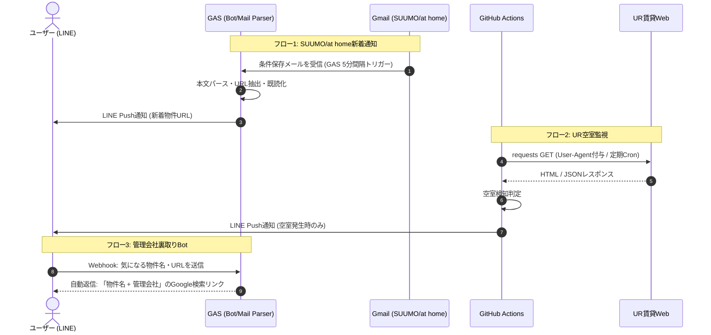

# 物件探し自動化システム (Real Estate Search Automation)

「SUUMO/at homeの広域相場把握」「UR賃貸の空室監視」「LINE Botによる裏取り・管理会社特定」の3つのフローを、完全無料（サーバーレス）で自動化・効率化するシステムです。

---

## 1. 必要なもの（Prerequisites）

### アカウント・サービス（すべて無料枠）
* **Google アカウント**: Gmail受信、Google Apps Script (GAS) 実行用
  * ※ clasp利用のため、あらかじめ「[Google Apps Script ユーザー設定](https://script.google.com/home/usersettings)」で **Google Apps Script API を「オン」** に設定してください。
* **GitHub アカウント**: コードのバージョン管理、GitHub Actions (UR定期監視) 用
* **LINE Developers アカウント**: LINE Messaging API (通知・Bot) 用
  * LINE Official Account の無料枠: **月200通までPush送信無料**（※返信〈Reply〉は無制限無料）。

### ローカル開発環境
* **OS**: macOS / Linux / Windows (WSL2推奨)
* **Node.js**: v18.x 以上 / npm
* **Python**: 3.10 以上 (UR監視スクリプトのローカル検証用)
* **Git**: バージョン管理
* **VS Code** (推奨エディタ)

---

## 2. システム設計 (Architecture)

### 2.1. 構成図 (Sequence Diagram)



### 2.2. 各コンポーネントの責務と仕様
| コンポーネント | ディレクトリ | 実行基盤 | トリガー | 備考・注意点 |
| :--- | :--- | :--- | :--- | :--- |
| **新着メールパーサー** | `gas/src/emailParser.ts` | GAS | 時間主導型 (5分毎) | SUUMO/at homeの検索条件保存メールを検知してLINE送信 |
| **裏取り返信Bot** | `gas/src/main.ts` | GAS (Web App) | LINE Webhook (`doPost`) | 物件名から検索URLを生成してReply（**無料・無制限**） |
| **UR空室チェッカー** | `python_scraper/` | GitHub Actions | Cron 定期実行 | 差分検知時のみLINE Push送信（API枠の節約） |

---

## 3. ディレクトリ構成

リポジトリ直下でGAS (TypeScript/clasp) と Python (GitHub Actions) をモノレポ形式で統合管理します。

```text
my-estate-bot/
├── .github/
│   └── workflows/
│       └── ur_monitor.yml       # GitHub Actions 定期実行ワークフロー
├── gas/                         # Google Apps Script 管理環境
│   ├── .clasp.json              # clasp設定ファイル (scriptId定義)
│   ├── .claspignore             # GASアップロード除外設定
│   ├── appsscript.json          # GASマニフェスト (タイムゾーン設定)
│   ├── package.json             # TypeScript / clasp / 型定義
│   ├── tsconfig.json            # TypeScriptコンパイル設定
│   └── src/
│       ├── main.ts              # Webhook (doPost) エントリポイント
│       ├── emailParser.ts       # Gmail解析・新着判定ロジック
│       └── lineClient.ts        # LINE Messaging API クライアント共通処理
├── python_scraper/              # UR賃貸スクレイピング環境
│   ├── requirements.txt         # 依存ライブラリ (requests, beautifulsoup4)
│   └── ur_check.py              # UR空室監視＆LINE通知スクリプト
├── .gitignore                   # Git除外設定 (.clasp.json, venv, node_modules等)
└── README.md                    # 本ドキュメント
```

---

## 4. 環境構築手順 (Setup Guide)

### 4.1. プロジェクトディレクトリの作成とGit初期化

端末（ターミナル）を開き、プロジェクト用ディレクトリを作成してGit初期化を行います。

```bash
# 1. プロジェクトディレクトリの作成と移動
mkdir my-estate-bot
cd my-estate-bot

# 2. Gitリポジトリの初期化
git init

# 3. 必要なサブディレクトリの一括作成
mkdir -p .github/workflows gas/src python_scraper
```

### 4.2. `.gitignore` の作成

認証情報や仮想環境がGitに混入しないよう、プロジェクトルートに `.gitignore` を配置します。

```bash
cat << 'EOF' > .gitignore
# OS / Editor
.DS_Store
Thumbs.db
.vscode/
.idea/

# Node.js / clasp
node_modules/
npm-debug.log
.clasp.json
.clasprc.json

# Python
__pycache__/
*.py[cod]
venv/
.env

# Build Artifacts
dist/
EOF
```

### 4.3. GAS (TypeScript / clasp) のセットアップ

```bash
cd gas

# 1. パッケージ定義の初期化
npm init -y

# 2. clasp、TypeScript、GAS型定義のインストール
npm install -D @google/clasp typescript @types/google-apps-script

# 3. tsconfig.json の作成 (GAS向け設定)
cat << 'EOF' > tsconfig.json
{
  "compilerOptions": {
    "target": "ES2020",
    "module": "None",
    "lib": ["ES2020"],
    "strict": true,
    "noImplicitAny": true,
    "types": ["google-apps-script"]
  },
  "include": ["src/**/*"]
}
EOF

# 4. .claspignore の作成 (不要ファイルのGASプッシュ防止)
cat << 'EOF' > .claspignore
**/*
!appsscript.json
!src/**/*.ts
!src/**/*.js
EOF

# 5. Googleアカウントへログイン (ブラウザが開きます)
npx clasp login

# 6. 新規GASプロジェクトの作成 (スタンドアロン型)
npx clasp create --type standalone --title "EstateAutoBot" --rootDir ./src
```

※ `clasp create` 実行時にカレントディレクトリに `.clasp.json` と `src/appsscript.json` が生成されます。`.clasp.json` の `"rootDir"` が `./src` になっていることを確認してください。

### 4.4. Python スクレイピング環境のセットアップ

```bash
cd ../python_scraper

# 仮想環境作成と有効化
python -m venv venv
source venv/bin/activate  # Windows (PowerShell): .\venv\Scripts\Activate.ps1

# 依存パッケージのインストール
pip install requests beautifulsoup4
pip freeze > requirements.txt

# ルートに戻る
cd ..
```

---

## 5. 設定・デプロイ手順 (Configuration & Deployment)

### 5.1. LINE Developers の設定
1. [LINE Developers コンソール](https://developers.line.biz/) にログイン。
2. 新規プロバイダーを作成し、「**Messaging API**」チャネルを作成。
3. **チャネル設定**:
   * 「Messaging API設定」タブより **チャネルアクセストークン（長期）** を発行して保存。
   * 「チャネル基本設定」タブ最下部にある **あなたのユーザーID** (`U`から始まる文字列) をメモ。
   * 「応答設定」で「応答メッセージ」をオフ、「Webhook」をオンに設定。

### 5.2. GAS のデプロイと環境変数設定
1. `gas/src/` 配下にTypeScriptコードを配置。
2. GASへソースコードを反映:
   ```bash
   cd gas
   npx clasp push
   ```
3. ブラウザでスクリプトエディタを開く:
   ```bash
   npx clasp open
   ```
4. **スクリプトプロパティの登録**:
   * プロジェクトの設定（歯車アイコン） >「スクリプト プロパティ」を開く。
   * 以下のキーと値を登録:
     * `LINE_ACCESS_TOKEN`: LINEのチャネルアクセストークン
     * `LINE_USER_ID`: 取得したご自身のLINEユーザーID
5. **Webアプリとしてのデプロイ**:
   * 「デプロイ」>「新しいデプロイ」をクリック。
   * 種類:「ウェブアプリ」を選択。
   * 次のユーザーとして実行:「自分」
   * アクセスできるユーザー:「全員 (Anyone)」
   * デプロイ完了後、発行された **ウェブアプリのURL** をコピー。
6. **LINE Webhook URL の登録**:
   * LINE Developers の「Webhook URL」にコピーしたURLを登録し、「検証 (Verify)」が成功することを確認。
7. **定周期トリガーの設定**:
   * エディタ左メニュー「トリガー (時計アイコン)」>「トリガーを追加」。
   * メール監視関数（例: `checkNewHouseEmails`）を「時間主導型」「分ベースのタイマー」「5分おき」で設定。

### 5.3. GitHub Actions のシークレット設定 (UR定期監視)
1. 作成したローカルリポジトリをGitHubの新規プライベートリポジトリへプッシュ:
   ```bash
   git add .
   git commit -m "feat: initial commit with project structure and setup docs"
   git branch -M main
   git remote add origin <YOUR_GITHUB_REPO_URL>
   git push -u origin main
   ```
2. リポジトリの **Settings > Secrets and variables > Actions** を開く。
3. **Repository secrets** に以下を登録:
   * `LINE_ACCESS_TOKEN`: LINEのチャネルアクセストークン
   * `LINE_USER_ID`: ご自身のLINEユーザーID
4. **Cronスケジュールに関する重要事項**:
   * GitHub Actions の Cron は **UTC基準**（JST - 9時間）です。
   * 例: 日本時間 10:00 に実行したい場合、Cron定義は `0 1 * * *` と記述します。
   * 無料枠のGitHub Actions Cronは混雑状況により数分〜数十分の遅延が発生することがありますが、物件監視用途であれば問題ありません。

---

## 6. 運用時のベストプラクティス・注意点

1. **LINE Push通知枠の消費抑制**:
   * LINE公式アカウントの無料枠は月200通です。5分毎のメール確認で「新着0件」のときは絶対にPush通知を飛ばさず、**本当に新着物件があったときのみ通知**するように実装してください。
   * 一方で、Botへのメッセージ送信に対する自動返信 (`replyToken` を使ったReply) は月200通の制限対象外（完全無料）です。
2. **UR賃貸スクレイピングの留意点**:
   * リクエスト送信時は必ずヘッダーに一般的なブラウザの `User-Agent` を設定してください（Bot判定による403エラー回避）。
   * サーバー負荷を避けるため、実行間隔は1時間〜数時間おき程度を推奨します。